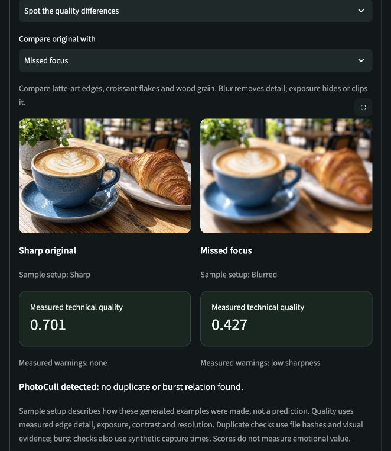

# PhotoCull

**Review a photo collection, understand the differences between similar shots, and build a shortlist without changing your originals.**

PhotoCull is a privacy-first photo review application built with Python and Streamlit. It helps you find repeated images, inspect technical issues, organize likely events, and choose representative photos. Each recommendation comes with measurable evidence so you can make the final decision.

Imagine returning from a trip with several copies of the same landscape, a burst of action shots, and a few blurred or poorly exposed pictures. PhotoCull groups related images, explains their differences, and helps you mark the ones you want to keep or revisit. It never automatically deletes photos.

[Try the hosted demo](https://cameraai-sree.streamlit.app/) · [Project page](https://sreekaran-portfolio.vercel.app/projects/photocull) · [Run locally](#run-photocull-locally) · [Evaluation results](#evaluation-and-current-limitations)

> Only the **Local Edition** keeps photos on your device. Images uploaded to the **Web Demo** reach the demo server for temporary processing. Choose the bundled samples if you want to explore without uploading anything.

## What you can do

| Feature | What it helps you understand |
| --- | --- |
| Exact duplicates | Which files contain exactly the same bytes. |
| Near duplicates | Which visually similar images may be alternative copies or versions of the same photo. |
| Burst detection | Which changing frames likely belong to the same photographic moment. A burst does not imply that its frames are redundant. |
| Technical quality | Whether edge detail, exposure, contrast, or resolution deserves a closer look. |
| Event discovery | Which images likely belong to the same occasion based on capture times. |
| Best Photos | A technical shortlist with explanations and coverage of different moments. |
| Personal preferences | An optional, experimental way to teach PhotoCull using explicit comparisons. |
| Review and export | Mark Keep, Favorite, or Review; download CSV/JSON metadata to continue your review. |

PhotoCull does not measure emotional significance or establish which image is artistically best. A dark silhouette, a soft portrait, or a meaningful imperfect photo may be exactly the one you want to keep.

## Try the demo without your own photos

Open the Web Demo and select **Try Demo Without Uploading Photos**. The bundled set contains 12 AI-generated photographic samples across three scenes. It requires no account or paid API.

1. **Start in Overview.** Read the collection counts, then open the side-by-side comparison under **See the difference for yourself**.
2. **Compare quality differences.** Look at the café image's latte art, croissant flakes, and wood grain. Switch between missed focus, dark exposure, and bright exposure; compare the visible changes with PhotoCull's measured warnings.
3. **Compare duplicate examples.** The lake's original and exact copy should look identical. Recompressed and resized versions illustrate why different files can still represent the same image.
4. **Compare burst frames.** Watch the dog's leg positions change between frames. These images share a moment but contain visibly different poses.
5. **Explore the result pages.** Use Review for related images, Events for occasions, and Best Photos for recommendations. Mark a choice and inspect its explanation.
6. **Try Export or clear the session.** Export downloads review metadata. **Clear temporary session** releases PhotoCull's session state.

The current bundled set produces one exact-copy group, one near-duplicate group, one burst group, and three events using the unchanged detector rules. Sample descriptions explain the fixture setup; predictions come from analysis. Capture times are authored teaching metadata, and the dog sequence is synthetic.

See [dataset provenance and generation prompts](docs/demo-dataset.md) and [measured sample results](benchmarks/demo-v2-validation.json). The photographic replacement is a local repository change until published to the hosted app.



## Choose an edition

| | Local Edition | Web Demo |
| --- | --- | --- |
| Input | A folder on the computer running PhotoCull | Explicit browser uploads or bundled samples |
| Processing | On your device | On the demo server |
| Storage | Private local SQLite database and derived cache | Bounded session memory; no intentional PhotoCull disk persistence of uploads |
| Review choices | Persist across runs | Last for the temporary session |
| Preference learning | Persistent local feedback and model | Temporary session feedback and model |
| Optional embeddings | Explicitly installed local models | Disabled; no model runtime |
| Intended use | Reviewing your own collections | Exploring the workflow with small collections |
| Entry point | `src/photocull/ui/app.py` | `streamlit_app.py` |

Web sessions accept up to **30 images**, **15 MiB per image**, **60 MiB cumulative uploads**, and **8 megapixels per image**. They expire after inactivity, and a process restart loses their state. Hosting infrastructure and browser/framework buffers have their own lifecycles; PhotoCull does not promise forensic RAM erasure or control over a provider's retention policies.

## Run PhotoCull locally

### Requirements

- Python **3.11 or newer**; Python 3.13.6 on Apple Silicon/macOS is the verified development runtime.
- macOS or Linux. The Local Edition uses POSIX file locking; Windows is not currently supported. Linux has not been validated on the development host.
- CPU processing; no GPU, cloud credentials, external database, or model download is required for the default workflow.

Run the following commands from the repository root:

```sh
python3 -m venv .venv
.venv/bin/python -m pip install --upgrade pip
.venv/bin/python -m pip install -e '.[dev,events]'
```

Start the Local Edition:

```sh
.venv/bin/streamlit run src/photocull/ui/app.py \
  --server.address 127.0.0.1 \
  --browser.gatherUsageStats false \
  --server.headless true
```

Open the localhost URL printed in the terminal. Enter an **absolute path** to a photo folder on that computer and start analysis. Package installation needs internet access; default analysis works offline afterward.

Supported inputs are **JPG/JPEG, PNG, and WEBP**. HEIC and RAW are unsupported. Animated PNG/WEBP uses the first frame. PhotoCull applies EXIF orientation before measuring an image.

### Run the Web Demo on your computer

Using the environment above:

```sh
.venv/bin/streamlit run streamlit_app.py \
  --server.address 127.0.0.1 \
  --server.port 8518 \
  --browser.gatherUsageStats false \
  --server.headless true
```

A web-only environment can install `requirements.txt` instead of the editable local package. For hosted deployment, use **`streamlit_app.py`**, never the local folder UI. See [deployment instructions](docs/deployment.md). Portfolio presentation supports `?embed=true&compact=true`; see [embedding instructions](docs/portfolio-embed.md).

### Local cache configuration

Local data defaults to `~/.photocull/`. The cache contains source metadata, measurements, hashes, generated thumbnails, review decisions, event edits, and optional preference data. Originals remain in their source folder.

The cache must be separate from the source folder and must not have symlinked ancestors. Set `PHOTOCULL_CACHE_DIR` to choose another absolute cache path and `PHOTOCULL_CONFIG` to select a TOML configuration file. See [setup](docs/setup.md) and [storage](docs/storage.md) for details.

## How the analysis works

```text
Photo input
  → Decode, orientation correction, metadata and file fingerprint
  → Technical measurements, perceptual hashes and preview
  → Exact / near-duplicate / burst grouping
  → Event discovery
  → Explained ranking and shortlist
  → Your review choices and metadata export
```

The two editions share the core image-analysis and similarity logic. Local analysis stores versioned results in SQLite and reuses compatible cached components for unchanged files. Its background worker reports progress and isolates per-file failures so one unreadable photo does not stop the whole collection. The Web Demo uses bounded in-memory sources and session state.

### Technical quality

Technical Quality v1 combines normalized sharpness, exposure, contrast, and resolution:

```text
quality = 0.40 × sharpness + 0.25 × exposure
        + 0.20 × contrast  + 0.15 × resolution
```

Sharpness uses edge variation; exposure examines luminance and dark/bright fractions; contrast uses luminance percentiles; resolution uses oriented dimensions. Cards expose warnings and explanations. The score is a technical indicator, not a probability of being a good photograph. Texture, noise, intentional darkness, and scene content can confound these measurements. [Full feature definitions](docs/features.md)

### Similarity and events

Exact detection uses SHA-256 file hashes. Near-duplicate analysis uses perceptual hashes with conservative visual checks and grouping rules. Burst analysis also considers capture-time proximity. These categories are shown separately to avoid treating every similar scene as an unnecessary copy.

Default event discovery uses capture times with a development-selected two-hour gap. Uncertain timestamp sources are marked accordingly. Local users can rename events, move or remove photos, merge events, and split subsets; manual corrections survive automatic reruns. Event names are neutral rather than inferred descriptions of what happened. [Duplicate methodology](docs/duplicates.md) · [Event methodology](docs/phase4-report.md)

### Ranking and preferences

Generic ranking A uses Technical Quality v1. Ranking B adds representation, guarded uniqueness, similarity penalties, and soft coverage. Known duplicate or burst groups contribute at most one recommendation to a shortlist. Best Photos offers Best 10/20, Favorites, and contextual recommendations, with reasons and weaker points on each card.

Optional personalization C learns from explicit contextual pair choices using 15 interpretable scalar features and regularized pairwise logistic regression. Favorites do not silently train it. It starts inactive and falls back to generic ranking when its requirements are unmet.

Activation requires at least 50 decisive training pairs across three connected groups, plus 10 held-out pairs across two groups where C outperforms A and B. Ties, skips, and repeated choices do not count toward training. These checks are exploratory safeguards, not proof of human benefit. [Ranking report](docs/phase5-report.md) · [Preference learning report](docs/phase6-report.md)

Optional MobileNet/TinyCLIP embeddings require explicit dependency installation and local weight setup. Hybrid similarity remains experimental: it recovered more matches but failed the expanded precision gate, so hash-based analysis stays the default. Ordinary scans do not download models. [Embedding setup and limitations](docs/embeddings.md)

## Privacy, safety, and exports

- **Local processing:** no remote inference, photo uploads, hosted database, or PhotoCull telemetry in the Local Edition. Optional explicit model setup downloads public weights.
- **Read-only originals:** neither edition moves, modifies, copies, or deletes your original photos. Suggested reclaimable bytes are estimates, not deletion actions.
- **Private derived data:** local paths, filenames, thumbnails, feedback, and model features can be sensitive. PhotoCull does not encrypt its database; protect the cache and backups as you would your photos.
- **Explicit exports:** CSV/JSON downloads contain ranks, events, metrics, explanations, and review labels, not original images. Local exports include source paths; web exports use a session-upload placeholder.
- **Separate cleanup controls:** clearing derived cache preserves original files, source records, scan history, review decisions, manual event edits, and preference data. Resetting learned preferences removes preference data/model while preserving photo analysis and review choices.

The local UI is intended for a trusted local user and binds to loopback in these examples. It is not an authenticated service for public network hosting. [Complete privacy model](docs/privacy.md)

## Evaluation and current limitations

The repository includes reproducible generated fixtures and authored or simulated labels. **No real-user photographic accuracy or personalization improvement has been established.**

| Frozen evaluation | Result | Interpretation |
| --- | --- | --- |
| Near-duplicate pair classification | 98.36% precision, 71.43% recall | Synthetic held-out set; not a general photographic accuracy claim |
| Near-duplicate grouping | 100% precision, 71.43% recall | Same labeled fixture pairs after conservative grouping |
| Time-only event discovery | ARI 0.8743, NMI 0.9671 | Synthetic occasions and timestamps |
| Ranking A / B | Macro NDCG 0.6213 / 0.6198 | B did not improve A on this authored benchmark |
| Human personalization | No evaluated human labels | Real-user benefit remains unclaimed |

The previously proposed **96% precision / 89% recall** statement is not supported by the frozen verified results. Burst pair detection and final burst grouping also have different recall; grouping intentionally remains conservative. Consult [verified results](docs/verified-results.md) for the complete scope, regressions, and machine-readable sources.

The visible demo samples teach the workflow; they are not an accuracy benchmark. Historical Phase 7 timing measurements used the former illustrated demo dataset and must not be attributed to the newer photographic set. Synthetic timings are not hosted latency or concurrent-load promises.

Current limits include unsupported HEIC/RAW, imperfect near-duplicate recall, uncertain event timestamps, experimental embeddings and personalization, and technical scores that cannot establish emotional or artistic value. [Detailed limitations](docs/limitations.md)

## Command-line use

The CLI uses the same local pipeline. Global options go before the subcommand:

```sh
# Validate files and record metadata without derived quality/hash/preview outputs
.venv/bin/photocull --cache-dir .photocull scan /absolute/photo/folder

# Analyze quality, similarity groups, and events
.venv/bin/photocull --cache-dir .photocull analyze /absolute/photo/folder

# Include full duplicate detection evidence in the JSON result
.venv/bin/photocull --cache-dir .photocull duplicates /absolute/photo/folder

# Force fresh hashing and computation
.venv/bin/photocull --cache-dir .photocull analyze /absolute/photo/folder --thorough

# Inspect or clear application-owned derived cache
.venv/bin/photocull --cache-dir .photocull cache status
.venv/bin/photocull --cache-dir .photocull cache clear
```

Results are sorted-key JSON on stdout; warnings/errors go to stderr. Exit codes are `0` for completion (possibly with isolated file failures), `1` for a failed run, and `2` for invalid input. There is no source-deletion API or full-reset command. Use `.venv/bin/photocull --help` to explore the evaluation and model commands.

## Development and validation

Core technologies are **Python, Streamlit, Pillow, NumPy, headless OpenCV, and SQLite**. Optional extras add scikit-learn for event experiments and PyTorch/torchvision/OpenCLIP for local embeddings.

```sh
.venv/bin/pytest -q
.venv/bin/ruff check src tests
.venv/bin/ruff format --check src tests
.venv/bin/python -m pip check
.venv/bin/python -m compileall -q src
```

The latest photographic demo change passed **157 tests**. Tests deny Python socket connections, including an offline CLI subprocess test. This validates network-independent Python analysis; it is not an OS firewall or packet-capture guarantee.

For dependency vulnerability checks:

```sh
.venv/bin/pip-audit --local --skip-editable --progress-spinner off
```

Auditing contacts a package advisory service with package identifiers, never photo data. `requirements-lock.txt` records tested versions on a compatible environment; it is not a cross-platform, hash-verified lockfile. Declared dependency ranges live in `pyproject.toml`.

### Repository map

```text
streamlit_app.py        Public upload-only demo entry point
src/photocull/          Analysis, storage, jobs, CLI and UI
assets/demo/           Bundled photographic teaching samples and sources
configs/               Analysis configuration
tests/                Automated tests
benchmarks/            Fixture generators, evaluations and recorded results
docs/                 Methodology, privacy, setup and phase reports
```

## Further reading

| Topic | Documentation |
| --- | --- |
| Installation and cache configuration | [Setup](docs/setup.md), [storage](docs/storage.md) |
| Pipeline and background workers | [Architecture](docs/architecture.md), [Phase 7 product report](docs/phase7-report.md) |
| Technical measurements and hashing | [Features](docs/features.md), [hashing](docs/hashing.md) |
| Duplicate evaluation | [Methodology](docs/duplicates.md), [evaluation](docs/duplicate-evaluation.md), [Phase 2 report](docs/phase2-report.md) |
| Optional local models | [Embeddings](docs/embeddings.md), [Phase 3 report](docs/phase3-report.md) |
| Events, ranking, and learning | [Phase 4](docs/phase4-report.md), [Phase 5](docs/phase5-report.md), [Phase 6](docs/phase6-report.md) |
| Human preference evaluation | [Private benchmark protocol](docs/preference-benchmark-protocol.md) |
| Evidence and performance | [Verified results](docs/verified-results.md), [evaluation](docs/evaluation.md), [performance](docs/performance.md) |
| Demo assets and hosting | [Dataset notes](docs/demo-dataset.md), [deployment](docs/deployment.md), [portfolio embed](docs/portfolio-embed.md) |
| Privacy and constraints | [Privacy](docs/privacy.md), [limitations](docs/limitations.md) |
